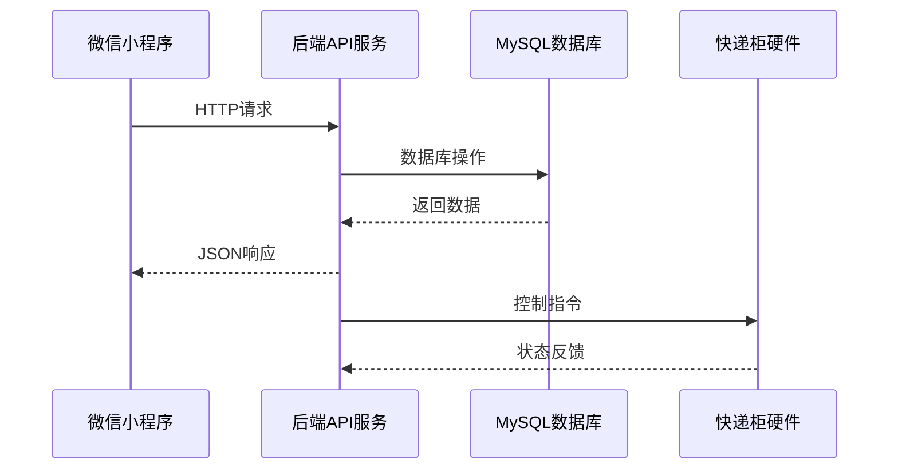
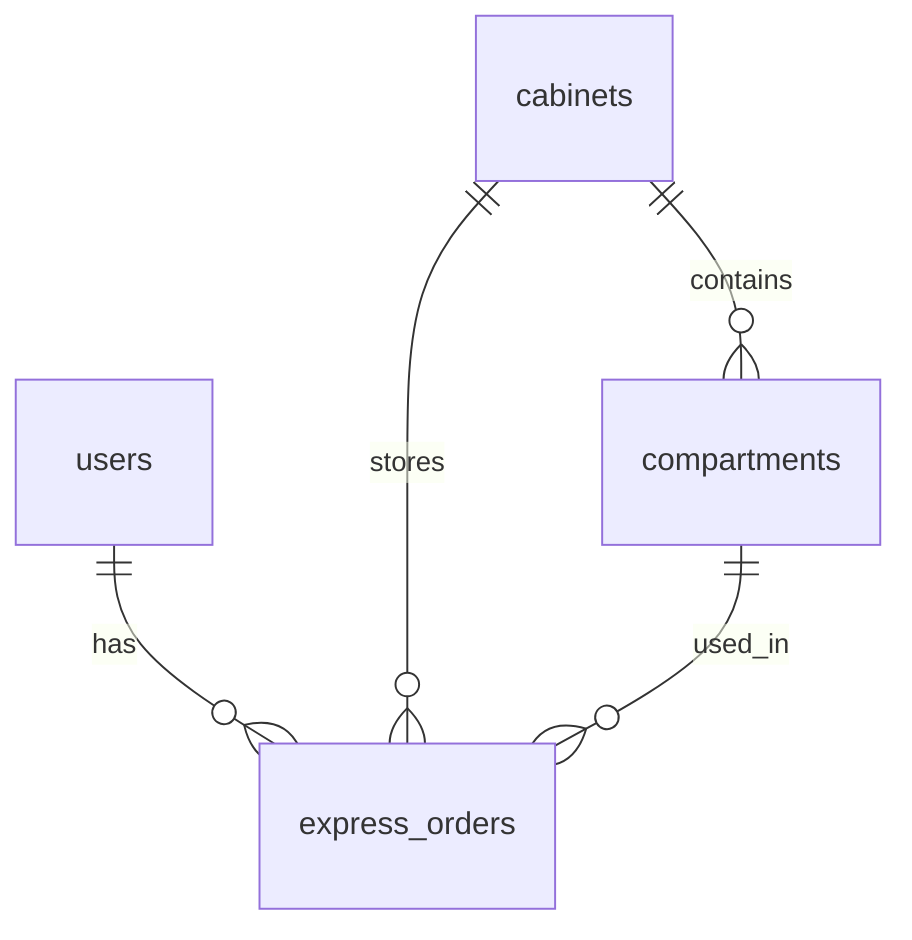
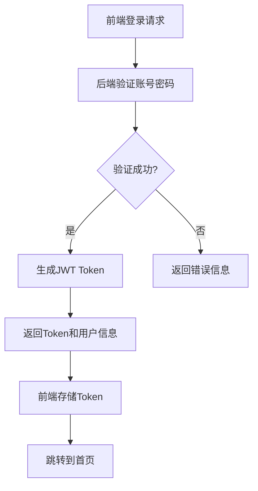
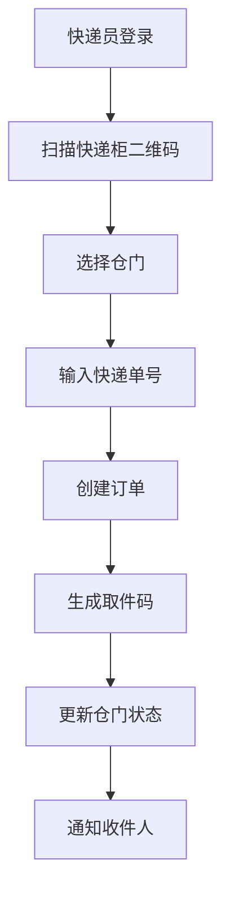
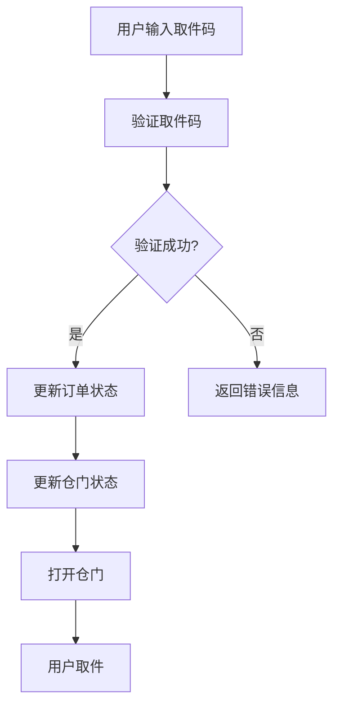
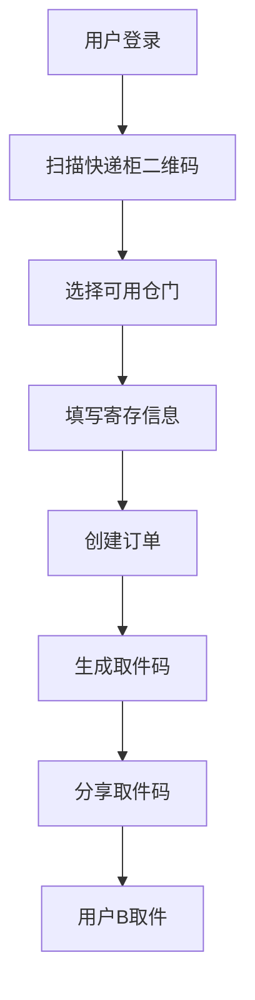
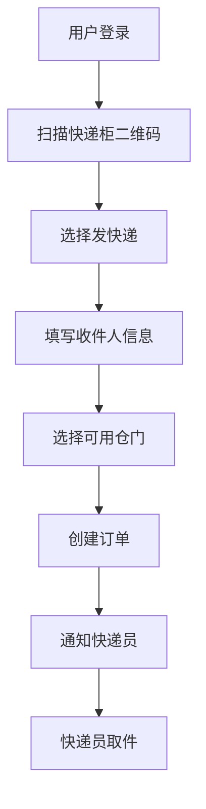

# 快递柜综合应用系统设计规格说明书

## 1. 引言

### 1.1 文档目的

本文档详细描述快递柜综合应用系统的设计规格，包括系统架构设计、详细设计、数据库设计等内容。文档旨在为开发团队提供详细的技术指导，确保系统开发符合需求规格，同时为后续的系统维护和扩展提供参考依据。

### 1.2 术语定义

| 术语 | 解释 |
|------|------|
| 快递柜 | 用于存放和取件的智能设备，包含多个仓门 |
| 仓门 | 快递柜中的单个存储单元，带电磁锁 |
| 取件码 | 用于取件的6位数字验证码 |
| 快递入柜 | 快递员将快递放入快递柜的操作 |
| 寄存 | 用户将物品放入快递柜的操作 |
| 发快递 | 用户通过快递柜发送快递的操作 |
| RESTful API | 前后端通信的接口规范，使用HTTP协议 |
| JWT | JSON Web Token，用于用户认证 |

## 2. 系统架构设计

### 2.1 整体架构

快递柜综合应用系统采用**前后端分离**的架构设计，主要由以下部分组成：



### 2.2 技术架构

| 层级 | 技术 | 版本 | 职责 |
|------|------|------|------|
| 前端 | 微信小程序 | 3.13.2 | 用户界面展示和交互 |
| 后端 | Spring Boot | 2.7.14 | 业务逻辑处理 |
| 后端 | Spring Data JPA | 2.7.14 | 数据库操作 |
| 后端 | JWT | 0.9.1 | 用户认证 |
| 数据库 | MySQL | 8.0+ | 数据存储 |
| 通信 | HTTP/RESTful | - | 前后端通信 |

### 2.3 模块划分

| 模块 | 职责 | 对应文件 |
|------|------|---------|
| 用户认证模块 | 用户注册、登录、Token管理 | server/backend/src/main/java/com/express/cabinet/controller/AuthController.java |
| 快递柜管理模块 | 快递柜信息管理、格口状态管理 | server/backend/src/main/java/com/express/cabinet/controller/CabinetController.java |
| 订单管理模块 | 快递订单创建、查询、取件 | server/backend/src/main/java/com/express/cabinet/controller/ExpressOrderController.java |
| 前端API封装 | 统一的HTTP请求封装 | user_xcx/utils/api.js |
| 前端业务接口 | 业务逻辑接口封装 | user_xcx/utils/service.js |
| 前端页面 | 用户界面展示和交互 | user_xcx/pages/ |

## 3. 详细设计

### 3.1 后端详细设计

#### 3.1.1 AuthController

**功能**：用户认证管理

**API接口**：
- `POST /api/auth/register` - 用户注册
- `POST /api/auth/login` - 用户登录

**核心方法**：
- `register(RegisterRequest request)` - 处理用户注册
- `login(LoginRequest request)` - 处理用户登录

**数据流程**：
1. 接收前端请求
2. 验证请求参数
3. 调用AuthService处理业务逻辑
4. 返回认证结果（包含Token）

#### 3.1.2 CabinetController

**功能**：快递柜管理

**API接口**：
- `GET /api/cabinets` - 获取所有快递柜
- `GET /api/cabinets/{id}` - 根据ID获取快递柜
- `GET /api/cabinets/code/{code}` - 根据编号获取快递柜
- `GET /api/cabinets/{cabinetId}/compartments` - 获取格口列表
- `GET /api/cabinets/{cabinetId}/compartments/available` - 获取可用格口
- `POST /api/cabinets/compartments/{compartmentId}/open` - 打开格口

**核心方法**：
- `getAllCabinets()` - 获取所有快递柜
- `getCompartments(Long cabinetId)` - 获取格口列表
- `openCompartment(Long compartmentId)` - 打开格口

**数据流程**：
1. 接收前端请求
2. 调用CabinetService处理业务逻辑
3. 返回快递柜或格口信息

#### 3.1.3 ExpressOrderController

**功能**：订单管理

**API接口**：
- `POST /api/orders` - 创建订单（存件）
- `GET /api/orders/phone/{phone}` - 根据手机号获取订单
- `GET /api/orders/user/{userId}` - 根据用户ID获取订单
- `GET /api/orders/pick-code/{pickCode}` - 根据取件码获取订单
- `POST /api/orders/pick-up` - 取件

**核心方法**：
- `createOrder(ExpressOrder order)` - 创建订单
- `pickUpOrder(Map<String, String> request)` - 处理取件

**数据流程**：
1. 接收前端请求
2. 调用ExpressOrderService处理业务逻辑
3. 返回订单信息

### 3.2 前端详细设计

#### 3.2.1 API请求封装

**文件**：`user_xcx/utils/api.js`

**功能**：统一的HTTP请求封装，处理网络请求、错误处理、Token管理

**核心方法**：
- `request(url, method, data)` - 基础请求方法
- `get(url, data)` - GET请求
- `post(url, data)` - POST请求
- `put(url, data)` - PUT请求
- `delete(url, data)` - DELETE请求

**数据流程**：
1. 从本地存储获取Token
2. 构建HTTP请求
3. 发送请求到后端API
4. 处理响应和错误
5. 返回Promise结果

#### 3.2.2 业务接口封装

**文件**：`user_xcx/utils/service.js`

**功能**：业务逻辑接口封装，调用api.js的方法

**核心模块**：
- `auth` - 认证相关接口
- `cabinet` - 快递柜相关接口
- `order` - 订单相关接口

**数据流程**：
1. 调用api.js的方法
2. 传递业务参数
3. 返回处理结果

#### 3.2.3 页面设计

**登录页面** (`user_xcx/pages/login/login`)
- **功能**：用户登录
- **核心方法**：`handleLogin()` - 处理登录请求
- **数据流程**：输入账号密码 → 调用登录API → 存储Token → 跳转到快递柜列表

**注册页面** (`user_xcx/pages/register/register`)
- **功能**：用户注册
- **核心方法**：`handleRegister()` - 处理注册请求
- **数据流程**：输入注册信息 → 调用注册API → 跳转到登录页

**快递柜列表页面** (`user_xcx/pages/cabinets/cabinets`)
- **功能**：显示快递柜列表
- **核心方法**：`loadCabinets()` - 加载快递柜列表
- **数据流程**：调用API获取快递柜列表 → 显示列表 → 点击进入详情

**快递柜详情页面** (`user_xcx/pages/cabinet-detail/cabinet-detail`)
- **功能**：显示快递柜详情和格口状态
- **核心方法**：`loadCabinetDetail()` - 加载快递柜详情
- **数据流程**：调用API获取详情 → 显示格口状态 → 点击格口进入存件

**存件页面** (`user_xcx/pages/store/store`)
- **功能**：处理存件操作
- **核心方法**：`handleSubmit()` - 处理存件请求
- **数据流程**：填写快递信息 → 调用创建订单API → 显示取件码

**取件页面** (`user_xcx/pages/pick-up/pick-up`)
- **功能**：处理取件操作
- **核心方法**：`handlePickUp()` - 处理取件请求
- **数据流程**：输入取件码 → 调用取件API → 显示取件结果

**订单列表页面** (`user_xcx/pages/orders/orders`)
- **功能**：显示用户订单
- **核心方法**：`loadOrders()` - 加载订单列表
- **数据流程**：调用API获取订单列表 → 显示订单记录

**个人中心页面** (`user_xcx/pages/profile/profile`)
- **功能**：用户信息管理
- **核心方法**：`handleLogout()` - 处理退出登录
- **数据流程**：显示用户信息 → 提供快捷功能入口

## 4. 数据库设计

### 4.1 数据库表结构

#### 4.1.1 users表

| 字段名 | 数据类型 | 约束 | 描述 |
|--------|---------|------|------|
| id | BIGINT | PRIMARY KEY, AUTO_INCREMENT | 用户ID |
| username | VARCHAR(50) | UNIQUE, NOT NULL | 用户名 |
| password | VARCHAR(255) | NOT NULL | 密码（加密存储） |
| phone | VARCHAR(20) | UNIQUE, NOT NULL | 手机号 |
| real_name | VARCHAR(50) | | 真实姓名 |
| user_type | TINYINT | NOT NULL, DEFAULT 0 | 用户类型（0-普通用户，1-快递员） |
| status | TINYINT | NOT NULL, DEFAULT 1 | 状态（0-禁用，1-启用） |
| created_at | DATETIME | DEFAULT CURRENT_TIMESTAMP | 创建时间 |
| updated_at | DATETIME | DEFAULT CURRENT_TIMESTAMP ON UPDATE CURRENT_TIMESTAMP | 更新时间 |

#### 4.1.2 cabinets表

| 字段名 | 数据类型 | 约束 | 描述 |
|--------|---------|------|------|
| id | BIGINT | PRIMARY KEY, AUTO_INCREMENT | 快递柜ID |
| cabinet_code | VARCHAR(50) | UNIQUE, NOT NULL | 快递柜编号 |
| location | VARCHAR(200) | | 位置 |
| status | TINYINT | NOT NULL, DEFAULT 1 | 状态（0-禁用，1-启用） |
| total_compartments | INT | NOT NULL, DEFAULT 8 | 总仓数 |
| power_consumption | DECIMAL(10,2) | DEFAULT 0 | 日用电量（度） |
| created_at | DATETIME | DEFAULT CURRENT_TIMESTAMP | 创建时间 |
| updated_at | DATETIME | DEFAULT CURRENT_TIMESTAMP ON UPDATE CURRENT_TIMESTAMP | 更新时间 |

#### 4.1.3 compartments表

| 字段名 | 数据类型 | 约束 | 描述 |
|--------|---------|------|------|
| id | BIGINT | PRIMARY KEY, AUTO_INCREMENT | 仓门ID |
| cabinet_id | BIGINT | NOT NULL, FOREIGN KEY | 快递柜ID |
| compartment_no | INT | NOT NULL | 仓门编号 |
| status | TINYINT | NOT NULL, DEFAULT 1 | 状态（0-故障/禁用，1-正常） |
| has_item | TINYINT | NOT NULL, DEFAULT 0 | 是否有物品（0-无，1-有） |
| temperature | DECIMAL(5,2) | | 温度 |
| humidity | DECIMAL(5,2) | | 湿度 |
| created_at | DATETIME | DEFAULT CURRENT_TIMESTAMP | 创建时间 |
| updated_at | DATETIME | DEFAULT CURRENT_TIMESTAMP ON UPDATE CURRENT_TIMESTAMP | 更新时间 |

#### 4.1.4 express_orders表

| 字段名 | 数据类型 | 约束 | 描述 |
|--------|---------|------|------|
| id | BIGINT | PRIMARY KEY, AUTO_INCREMENT | 订单ID |
| order_no | VARCHAR(50) | UNIQUE, NOT NULL | 快递单号 |
| cabinet_id | BIGINT | NOT NULL, FOREIGN KEY | 快递柜ID |
| compartment_id | BIGINT | NOT NULL, FOREIGN KEY | 仓门ID |
| sender_name | VARCHAR(50) | | 发件人姓名 |
| sender_phone | VARCHAR(20) | | 发件人手机号 |
| receiver_name | VARCHAR(50) | NOT NULL | 收件人姓名 |
| receiver_phone | VARCHAR(20) | NOT NULL | 收件人手机号 |
| receiver_user_id | BIGINT | FOREIGN KEY | 收件人用户ID |
| courier_id | BIGINT | FOREIGN KEY | 快递员ID |
| pick_code | VARCHAR(10) | NOT NULL | 取件码 |
| order_type | TINYINT | NOT NULL, DEFAULT 0 | 订单类型（0-快递入柜，1-用户寄存，2-用户发快递） |
| status | TINYINT | NOT NULL, DEFAULT 0 | 状态（0-待取件，1-已取件，2-已超时） |
| put_in_time | DATETIME | | 放入时间 |
| pick_up_time | DATETIME | | 取件时间 |
| expire_time | DATETIME | | 过期时间 |
| created_at | DATETIME | DEFAULT CURRENT_TIMESTAMP | 创建时间 |
| updated_at | DATETIME | DEFAULT CURRENT_TIMESTAMP ON UPDATE CURRENT_TIMESTAMP | 更新时间 |

### 4.2 数据库关系



### 4.3 索引设计

| 表名 | 索引 | 类型 | 用途 |
|------|------|------|------|
| users | idx_phone | UNIQUE | 加速手机号查询 |
| users | idx_user_type | NORMAL | 加速用户类型查询 |
| cabinets | idx_cabinet_code | UNIQUE | 加速快递柜编号查询 |
| cabinets | idx_status | NORMAL | 加速状态查询 |
| compartments | uk_cabinet_compartment | UNIQUE | 确保仓门编号唯一 |
| compartments | idx_cabinet_id | NORMAL | 加速仓门查询 |
| compartments | idx_status | NORMAL | 加速状态查询 |
| express_orders | idx_order_no | UNIQUE | 加速快递单号查询 |
| express_orders | idx_pick_code | NORMAL | 加速取件码查询 |
| express_orders | idx_receiver_phone | NORMAL | 加速收件人手机号查询 |
| express_orders | idx_status | NORMAL | 加速状态查询 |

## 5. 技术实现细节

### 5.1 后端技术实现

#### 5.1.1 Spring Boot配置

**核心配置文件**：`server/backend/src/main/resources/application.yml`

**主要配置**：
- 服务器端口：8080
- 上下文路径：/api
- 数据库连接：MySQL
- JWT配置：密钥和过期时间
- CORS配置：允许跨域请求

#### 5.1.2 安全实现

**认证机制**：
- 使用JWT进行用户认证
- 密码使用Spring Security加密存储
- API接口需要Token验证

**安全措施**：
- 防SQL注入：使用JPA参数化查询
- 防XSS攻击：前端输入验证
- 防CSRF攻击：使用Token验证

### 5.2 前端技术实现

#### 5.2.1 微信小程序配置

**核心配置文件**：`user_xcx/app.json`

**主要配置**：
- 页面路由配置
- 窗口样式配置
- 网络请求配置

#### 5.2.2 状态管理

**全局状态管理**：
- `user_xcx/app.js` 中的globalData
- 存储用户信息、Token等全局数据
- 提供setUserInfo、setToken等方法

**本地存储**：
- 使用wx.setStorageSync存储持久化数据
- 使用wx.getStorageSync获取存储数据

#### 5.2.3 网络请求

**请求封装**：
- `user_xcx/utils/api.js` 封装HTTP请求
- 自动添加Token到请求头
- 统一处理错误和异常

**API调用**：
- `user_xcx/utils/service.js` 封装业务接口
- 提供auth、cabinet、order等模块

## 6. 数据流程设计

### 6.1 用户认证流程



### 6.2 快递入柜流程



### 6.3 取件流程



### 6.4 寄存流程



### 6.5 发快递流程



## 7. 接口设计

### 7.1 后端API接口

#### 7.1.1 认证接口

| 接口 | 方法 | 功能 | 请求参数 | 成功响应 |
|------|------|------|----------|----------|
| /api/auth/register | POST | 用户注册 | username, password, phone | `{"code":200,"data":{"user":{...},"token":"..."}}` |
| /api/auth/login | POST | 用户登录 | username, password | `{"code":200,"data":{"user":{...},"token":"..."}}` |

#### 7.1.2 快递柜接口

| 接口 | 方法 | 功能 | 请求参数 | 成功响应 |
|------|------|------|----------|----------|
| /api/cabinets | GET | 获取所有快递柜 | - | `{"code":200,"data":[{...}]}` |
| /api/cabinets/{id} | GET | 根据ID获取快递柜 | id | `{"code":200,"data":{...}}` |
| /api/cabinets/code/{code} | GET | 根据编号获取快递柜 | code | `{"code":200,"data":{...}}` |
| /api/cabinets/{cabinetId}/compartments | GET | 获取格口列表 | cabinetId | `{"code":200,"data":[{...}]}` |
| /api/cabinets/{cabinetId}/compartments/available | GET | 获取可用格口 | cabinetId | `{"code":200,"data":[{...}]}` |
| /api/cabinets/compartments/{compartmentId}/open | POST | 打开格口 | compartmentId | `{"code":200,"data":"开仓成功"}` |

#### 7.1.3 订单接口

| 接口 | 方法 | 功能 | 请求参数 | 成功响应 |
|------|------|------|----------|----------|
| /api/orders | POST | 创建订单 | orderNo, receiverName, receiverPhone, cabinetId, compartmentId | `{"code":200,"data":{"pickCode":"..."}}` |
| /api/orders/phone/{phone} | GET | 根据手机号获取订单 | phone | `{"code":200,"data":[{...}]}` |
| /api/orders/user/{userId} | GET | 根据用户ID获取订单 | userId | `{"code":200,"data":[{...}]}` |
| /api/orders/pick-code/{pickCode} | GET | 根据取件码获取订单 | pickCode | `{"code":200,"data":{...}}` |
| /api/orders/pick-up | POST | 取件 | pickCode | `{"code":200,"data":{"compartmentNumber":"..."}}` |

### 7.2 前端API调用

#### 7.2.1 认证模块

```javascript
// user_xcx/utils/service.js
const service = {
  auth: {
    register(data) {
      return api.post('/auth/register', data)
    },
    login(data) {
      return api.post('/auth/login', data)
    }
  }
}
```

#### 7.2.2 快递柜模块

```javascript
// user_xcx/utils/service.js
const service = {
  cabinet: {
    getAll() {
      return api.get('/cabinets')
    },
    getById(id) {
      return api.get(`/cabinets/${id}`)
    },
    getCompartments(cabinetId) {
      return api.get(`/cabinets/${cabinetId}/compartments`)
    },
    getAvailableCompartments(cabinetId) {
      return api.get(`/cabinets/${cabinetId}/compartments/available`)
    }
  }
}
```

#### 7.2.3 订单模块

```javascript
// user_xcx/utils/service.js
const service = {
  order: {
    getByPhone(phone) {
      return api.get(`/orders/phone/${phone}`)
    },
    getByUserId(userId) {
      return api.get(`/orders/user/${userId}`)
    },
    getByPickCode(pickCode) {
      return api.get(`/orders/pick-code/${pickCode}`)
    },
    create(data) {
      return api.post('/orders', data)
    },
    pickUp(pickCode) {
      return api.post('/orders/pick-up', { pickCode })
    }
  }
}
```

## 7. 部署与集成方案

### 7.1 后端部署

**部署环境**：
- JDK 17+
- MySQL 8.0+
- Maven 3.6+

**部署步骤**：
1. 编译项目：`mvn clean package`
2. 运行jar包：`java -jar express-cabinet-backend.jar`
3. 数据库初始化：执行init.sql脚本

### 7.2 前端部署

**微信小程序部署**：
1. 微信开发者工具上传代码
2. 微信公众平台审核
3. 发布小程序

**Web管理平台部署**：
1. 构建项目：`npm run build`
2. 部署到Web服务器
3. 配置域名和HTTPS

### 7.3 集成测试

**测试策略**：
- 单元测试：测试核心方法
- 集成测试：测试模块间集成
- 端到端测试：测试完整业务流程

**测试工具**：
- 后端：JUnit、MockMvc
- 前端：微信开发者工具模拟器
- 性能测试：JMeter

## 8. 维护与扩展

### 8.1 系统维护

**日志管理**：
- 使用Spring Boot内置日志
- 配置日志级别和输出

**监控管理**：
- 监控系统运行状态
- 监控数据库连接和性能

**备份策略**：
- 数据库定期备份
- 代码版本控制

### 8.2 系统扩展

**功能扩展**：
- 支持更多快递柜类型
- 支持更多支付方式
- 支持更多用户认证方式

**技术扩展**：
- 集成短信服务
- 集成人脸识别
- 集成物联网平台

**性能扩展**：
- 数据库读写分离
- 缓存机制优化
- 服务集群部署

## 9. 设计约束

### 9.1 技术约束

- **微信小程序**：受微信小程序开发规范限制
- **MySQL**：受数据库性能和容量限制
- **Spring Boot**：受Java虚拟机性能限制

### 9.2 业务约束

- **安全性**：需要确保用户信息和快递信息安全
- **可靠性**：系统需要24小时稳定运行
- **可用性**：系统需要高可用性，减少故障时间

### 9.3 法律约束

- **隐私保护**：遵守用户数据隐私保护法规
- **合规性**：遵守快递行业相关法规

## 10. 附录

### 10.1 代码结构

**后端代码结构**：
```
server/backend/src/main/java/com/express/cabinet/
├── config/          # 配置类
├── controller/      # 控制器
├── dto/             # 数据传输对象
├── entity/          # 实体类
├── repository/      # 数据访问层
├── service/         # 业务逻辑层
├── util/            # 工具类
└── ExpressCabinetApplication.java  # 应用入口
```

**前端代码结构**：
```
user_xcx/
├── pages/           # 页面
│   ├── login/       # 登录页面
│   ├── register/    # 注册页面
│   ├── cabinets/    # 快递柜列表
│   ├── cabinet-detail/ # 快递柜详情
│   ├── store/       # 存件页面
│   ├── pick-up/     # 取件页面
│   ├── orders/      # 订单列表
│   └── profile/     # 个人中心
├── utils/           # 工具类
│   ├── api.js       # API请求封装
│   └── service.js   # 业务接口封装
├── app.js           # 应用入口
├── app.json         # 应用配置
└── app.wxss         # 全局样式
```

### 10.2 关键类和方法

**后端关键类**：
- `AuthController`：处理用户认证
- `CabinetController`：处理快递柜管理
- `ExpressOrderController`：处理订单管理
- `AuthService`：认证业务逻辑
- `CabinetService`：快递柜业务逻辑
- `ExpressOrderService`：订单业务逻辑
- `JwtUtil`：JWT工具类

**前端关键类**：
- `api.js`：API请求封装
- `service.js`：业务接口封装
- `app.js`：全局状态管理

### 10.3 数据库初始化脚本

**脚本路径**：`server/database/init.sql`

**主要功能**：
- 创建数据库表结构
- 插入测试数据
- 配置索引和约束

### 10.4 测试数据

**用户数据**：
| 用户名 | 密码 | 手机号 | 类型 |
|--------|------|--------|------|
| admin | 123456 | 13800138000 | 普通用户 |
| courier1 | 123456 | 13800138001 | 快递员 |
| user1 | 123456 | 13800138002 | 普通用户 |

**快递柜数据**：
| 编号 | 位置 | 状态 | 总仓数 |
|------|------|------|--------|
| CAB001 | 北京市朝阳区XX街道XX号 | 正常 | 8 |
| CAB002 | 北京市海淀区XX街道XX号 | 正常 | 8 |

**订单数据**：
| 快递单号 | 收件人 | 手机号 | 取件码 | 状态 |
|----------|--------|--------|--------|------|
| SF1234567890 | 张三 | 13800138000 | 123456 | 待取件 |

## 11. 设计变更记录

| 版本 | 日期 | 变更内容 | 变更人 |
|------|------|----------|--------|
| 1.0 | 2026-01-15 | 初始设计 | 设计团队 |
| 1.1 | 2026-01-17 | 修正数据库字段映射 | 开发团队 |
| 1.2 | 2026-01-17 | 优化前端页面交互 | 前端团队 |
